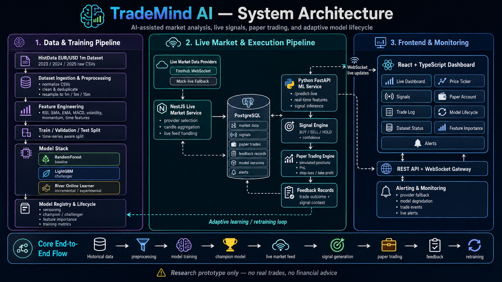
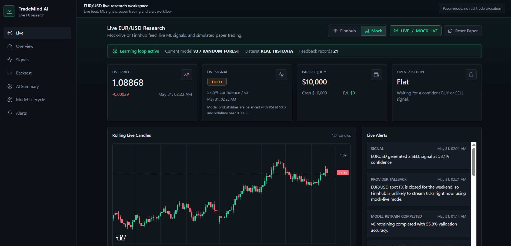
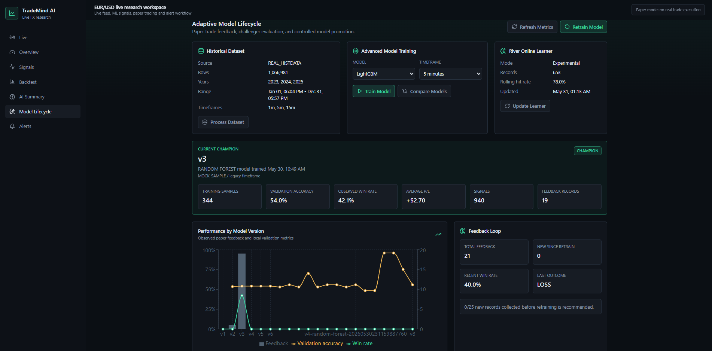
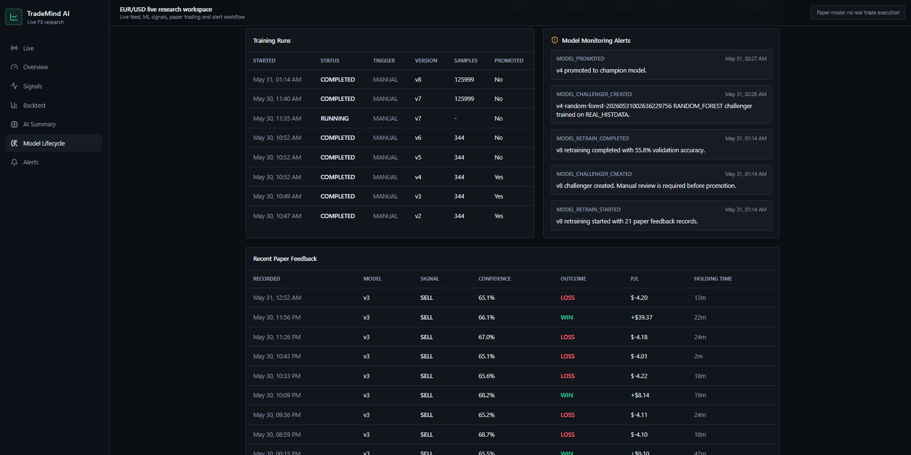
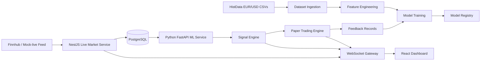

# TradeMind AI

Full-stack AI/ML market analysis dashboard with live signals, paper trading, and adaptive model lifecycle.

TradeMind AI is a research dashboard for experimenting with EUR/USD market data workflows. It processes historical candles, supports mock-live and optional Finnhub feeds, generates ML-based BUY / SELL / HOLD signals, simulates paper trades, and records trade outcomes for model review. A React dashboard ties the workflow together with live charts, alerts, backtesting metrics, dataset controls, and champion/challenger model tracking.

Repository: [github.com/BBeenniii/trademind](https://github.com/BBeenniii/trademind)

## Disclaimer

> Research prototype only. No real trades are executed. This project does not provide financial advice.

TradeMind AI is a technical demonstration. It does not connect to a brokerage account, submit orders, or claim profitable prediction. Backtest and paper-trading results are useful for software and ML workflow evaluation only.

## Screenshots






## Feature Overview

- Historical EUR/USD CSV ingestion with recursive folder detection
- HistData / MetaTrader-style file normalization
- OHLCV preprocessing and 1m, 5m, and 15m resampling
- Explainable technical feature engineering for returns, trend, momentum, volatility, RSI, MACD, and session context
- RandomForest baseline model
- LightGBM tabular challenger model
- Optional XGBoost challenger model
- Experimental River online learner
- Time-aware train / validation / test splits
- Local model artifacts and feature-importance metadata
- Model versioning with champion/challenger lifecycle management
- Mock-live EUR/USD provider for self-contained local demos
- Optional Finnhub WebSocket provider with automatic fallback
- BUY / SELL / HOLD research signals
- Simulated paper account, positions, stop loss, take profit, and trade history
- Feedback records that connect simulated outcomes to their originating signals
- Manual and threshold-based adaptive retraining workflows
- React dashboard with live charts, model views, backtests, AI summaries, and alerts
- Optional OpenAI summary generation with realistic local mock fallback
- PostgreSQL persistence, REST APIs, WebSocket updates, alerts, and scheduled workflows

## Tech Stack

**Frontend**

- React
- TypeScript
- Vite
- Tailwind CSS
- TanStack Query
- Recharts
- Lightweight Charts

**Backend**

- NestJS
- Prisma ORM
- PostgreSQL
- REST API
- Socket.IO WebSocket gateway
- Scheduled workflows with `@nestjs/schedule`

**ML Service**

- Python
- FastAPI
- pandas
- NumPy
- scikit-learn
- LightGBM
- River
- Optional XGBoost
- joblib

**Data and Integrations**

- HistData EUR/USD CSV data
- Finnhub WebSocket
- Mock-live fallback provider
- Docker Compose

## Architecture



The NestJS API coordinates the live research workflow and stores candles, signals, simulated trades, alerts, and model metadata in PostgreSQL. The Python service handles dataset processing, feature engineering, training, prediction, and online-learning experiments. WebSocket updates keep the React dashboard current while REST snapshots provide a fallback after reconnects.

## Repository Structure

```txt
trademind/
  apps/
    api/          # NestJS backend + Prisma
    frontend/     # React + TypeScript dashboard
    ml-service/   # Python FastAPI ML service
  docs/
    screenshots/
  scripts/
  docker-compose.yml
  trademind.cmd
  package.json
  .env.example
```

Raw datasets, processed datasets, model artifacts, logs, build output, dependencies, and local `.env` files are intentionally ignored.

## Prerequisites

- Node.js 18+
- npm
- Python 3.10+
- Docker Desktop
- Git
- Optional: [Finnhub](https://finnhub.io/) API key
- Optional: [HistData](https://www.histdata.com/) EUR/USD dataset

## Environment Setup

Copy the templates before the first run.

Windows PowerShell:

```powershell
Copy-Item .env.example .env
Copy-Item apps/api/.env.example apps/api/.env
Copy-Item apps/frontend/.env.example apps/frontend/.env
Copy-Item apps/ml-service/.env.example apps/ml-service/.env
```

Bash:

```bash
cp .env.example .env
cp apps/api/.env.example apps/api/.env
cp apps/frontend/.env.example apps/frontend/.env
cp apps/ml-service/.env.example apps/ml-service/.env
```

Replace placeholder values such as `YOUR_POSTGRES_PASSWORD_HERE` before starting PostgreSQL. External API keys are optional. The project works in mock-live mode without Finnhub, OpenAI, or other paid services.

## Running with Helper Commands

On Windows, the repository includes `trademind.cmd` and `scripts/trademind.ps1`. From the repository root:

| Command | Purpose |
| --- | --- |
| `.\trademind.cmd fire-up` | Start PostgreSQL, prepare Prisma, and start the ML service, API, and frontend |
| `.\trademind.cmd status` | Check local service and container status |
| `.\trademind.cmd stop` | Stop local services and PostgreSQL |
| `.\trademind.cmd install-command` | Install a user-level `trademind` command shim |

The launcher creates missing env files from their templates, installs missing dependencies, applies Prisma migrations, seeds demo records, and writes runtime logs under `logs/`.

After running:

```powershell
.\trademind.cmd install-command
```

open a new terminal and use:

```powershell
trademind fire-up
trademind status
trademind stop
```

The same launcher actions are available through the root npm scripts:

```bash
npm run fire-up
npm run status
npm run stop
npm run install-command
```

## Running Manually

Use separate terminals for the services.

PostgreSQL:

```bash
docker compose up -d postgres
```

ML service:

```bash
cd apps/ml-service
pip install -r requirements.txt
uvicorn main:app --reload --port 8000
```

Backend:

```bash
cd apps/api
npm install
npm run prisma:generate
npm run prisma:migrate
npm run prisma:seed
npm run start:dev
```

Frontend:

```bash
cd apps/frontend
npm install
npm run dev
```

Common local URLs:

- Frontend: `http://localhost:5173`
- Backend API: `http://localhost:3000`
- ML service: `http://localhost:8000`
- PostgreSQL: `localhost:55432` with the provided example configuration

## Optional: Finnhub Live Data

The application runs without a Finnhub key by using the mock-live provider. Finnhub is optional when you want to test an external WebSocket feed.

1. Create an account at [finnhub.io](https://finnhub.io/).
2. Open the Finnhub dashboard and copy your API key.
3. Update `apps/api/.env`:

```env
LIVE_MARKET_PROVIDER=finnhub
FINNHUB_API_KEY=YOUR_KEY_HERE
FINNHUB_SYMBOL=OANDA:EUR_USD
```

4. Restart the API or run the stack again.

If Finnhub is unavailable, the FX market is closed, or the configured plan does not stream usable EUR/USD ticks, the backend records a fallback alert and switches to mock-live mode.

Reference: [Finnhub API documentation](https://finnhub.io/docs/api)

## Optional: Real Historical Data with HistData

Large market datasets are not committed to GitHub. The ML service supports manually downloaded EUR/USD 1-minute MetaTrader CSV files from [HistData](https://www.histdata.com/).

HistData provides free Forex historical data in CSV formats that can be imported into MetaTrader and other tools. Download EUR/USD M1 data, extract the yearly archives, and place the folders anywhere under:

```txt
apps/ml-service/data/raw/
```

For example:

```txt
apps/ml-service/data/raw/
  2023/*.csv
  2024/*.csv
  2025/*.csv
```

The importer scans nested folders recursively, so vendor style extracted folder names also work.

Process the dataset from the Model Lifecycle dashboard or call:

```bash
curl -X POST http://localhost:3000/dataset/process
```

The service normalizes timestamps, removes invalid and duplicate rows, writes local processed files, and derives 5m and 15m bars from the 1m source. If no real dataset is present, the ML service uses local sample or deterministic mock data.

Reference: [HistData FAQ](https://www.histdata.com/f-a-q/)

## ML and Model Lifecycle

TradeMind AI uses a deliberately understandable model workflow:

- **RandomForest** is the baseline classifier.
- **LightGBM** is the primary tabular challenger.
- **XGBoost** is available as an optional challenger.
- **River** is an experimental online learner updated from simulated trade feedback. It does not silently replace the champion model.

Generated models are stored locally as ignored artifacts. New versions enter the registry as challengers. Promotion is manual by default, with validation metrics, feature importance, paper-trade feedback, and drawdown context available for review. Closed paper trades produce feedback records that connect each result back to its source signal and model version.

This lifecycle is intended to demonstrate practical ML system design, not to claim a profitable forecasting strategy.

## API and Service Overview

**React frontend**

- Live workspace with rolling candles and provider status
- Overview, signals, backtests, AI summary, alerts, and model lifecycle views
- REST hydration with WebSocket live updates

**NestJS backend**

- REST API and WebSocket gateway
- PostgreSQL persistence through Prisma
- Live-provider fallback handling
- Simulated paper trading and alert orchestration
- Dataset and model-lifecycle coordination

**FastAPI ML service**

- Dataset processing and metadata
- Feature engineering and resampling support
- Training, comparison, prediction, and backtesting
- Feature importance and River online-learning status

Useful health checks:

```txt
GET http://localhost:3000/health
GET http://localhost:8000/health
```

## What Is Intentionally Not Committed

The repository excludes:

- `.env` files and API keys
- Raw market datasets
- Processed datasets
- Generated model artifacts
- Runtime logs
- Build outputs
- `node_modules`
- Python cache files

Use the committed `.env.example` templates and place local datasets under `apps/ml-service/data/raw/`.

## Troubleshooting

**PostgreSQL authentication changed**

Reset the local Docker volume, then start PostgreSQL again. This removes local database contents:

```bash
docker compose down -v
docker compose up -d postgres
```

**Port already in use**

Check ports `3000`, `5173`, `8000`, and `55432`. PostgreSQL may use `5432` if you override the example configuration.

**Python package installation fails**

Create a Python virtual environment, upgrade `pip`, and reinstall:

```bash
python -m venv .venv
python -m pip install --upgrade pip
pip install -r requirements.txt
```

**No external live data**

Check `LIVE_MARKET_PROVIDER`, `FINNHUB_API_KEY`, and `FINNHUB_SYMBOL`. Use `LIVE_MARKET_PROVIDER=mock` when no Finnhub key is configured or the FX market is closed.

**Dataset is not detected**

Confirm that extracted CSV files exist somewhere below `apps/ml-service/data/raw/`, then process the dataset again.

**Prisma client or migration issues**

```bash
cd apps/api
npm run prisma:generate
npm run prisma:migrate
```

## Future Improvements

- Dockerize the API, frontend, and ML service alongside PostgreSQL
- Add a deployment profile
- Add richer model evaluation reports and walk forward analysis
- Add a vector database for research notes
- Add automated API, ML, and frontend tests
- Add a CI pipeline
- Add richer operational monitoring

## Final Disclaimer

This project is a technical demonstration and research prototype. It does not execute real trades, does not connect to a real brokerage account, and does not provide financial advice. Backtest or paper trading results do not imply profitability.

## License and Personal Note

This project was originally built as a learning and experimenting pet project. 
This version is cleaned and tuned for a technical demonstration showcase.
